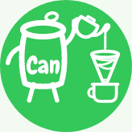
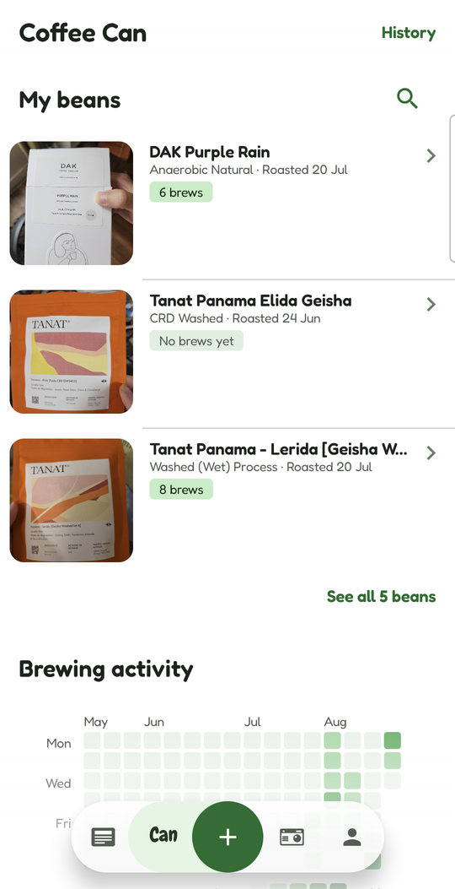
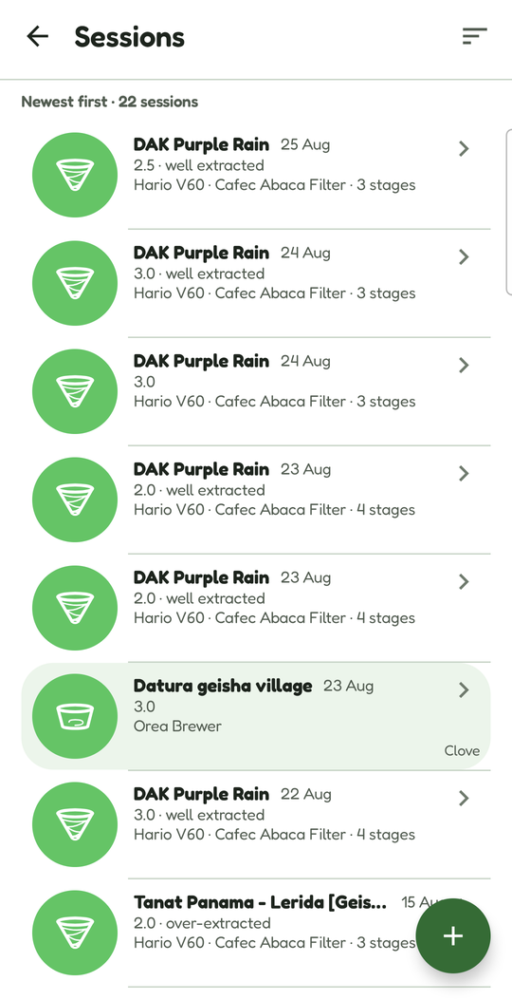
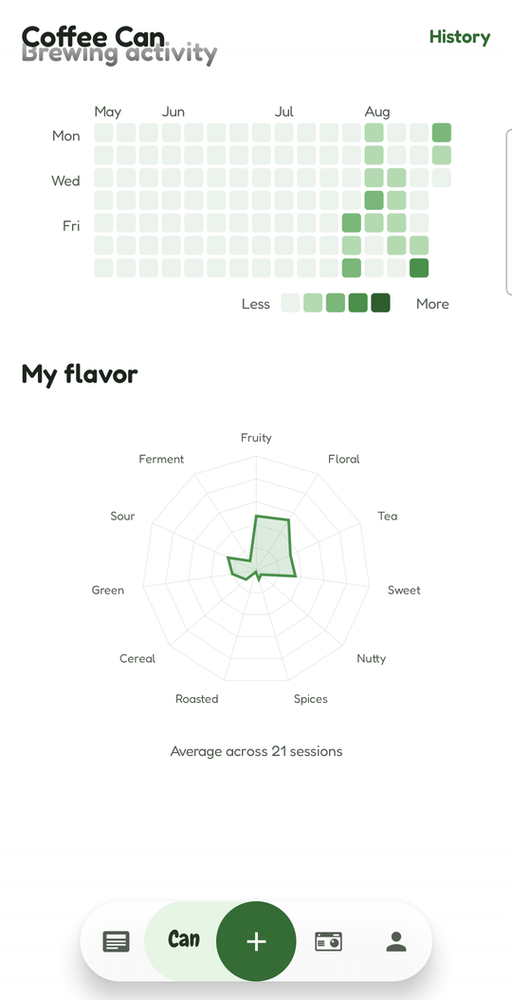
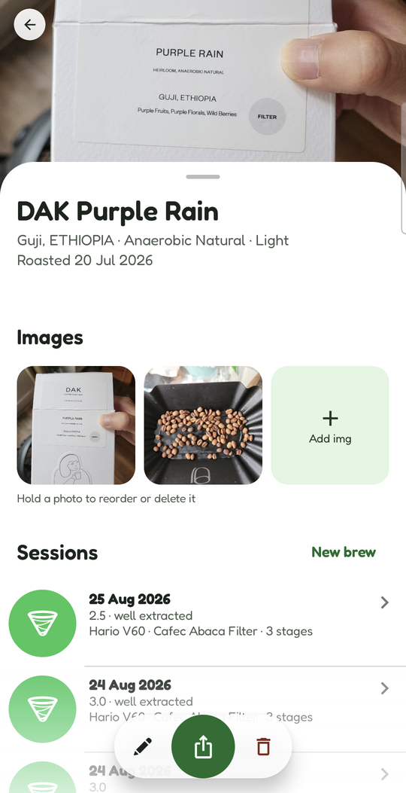
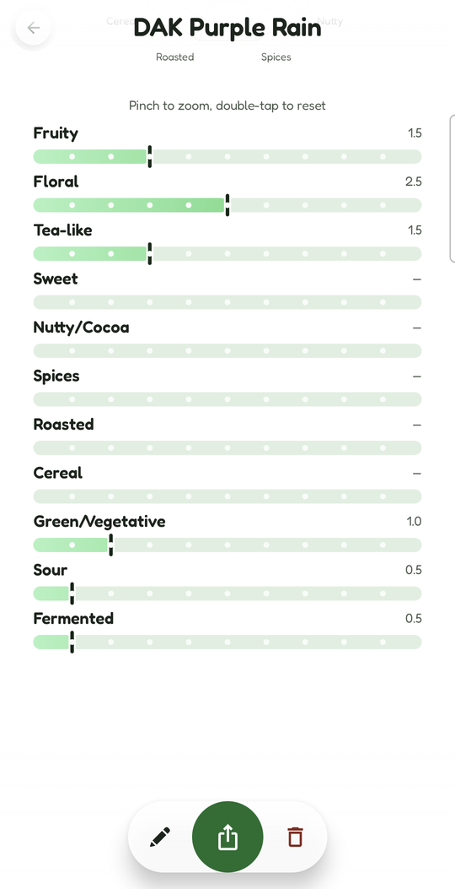
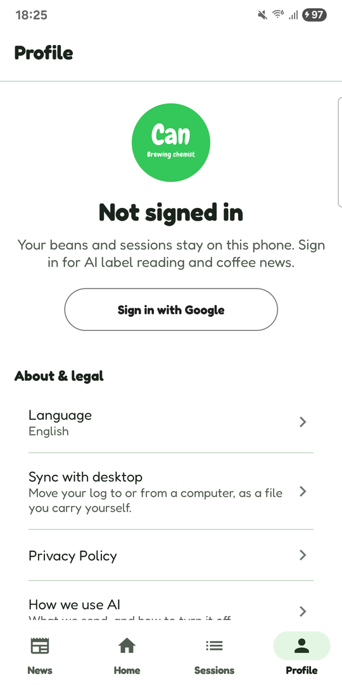
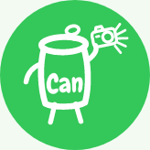

<div align="center">


# Coffee Can

### Every cup, remembered.

A bean journal, a brewing log and a flavour radar — on your desktop, on your
phone, and in the hands of an assistant that can fill them in for you.

<br>

[**📱 Android**](#android)  ·  [**🖥️ Desktop**](#desktop)  ·  [**🤖 Agent**](#agent)  ·  [**☁️ Gateway**](#server)

<br>

</div>

---

<a id="android"></a>

<div align="center">



# Coffee Can for Android

### The whole shelf, in your pocket.

Every bean profile, every pour, every tasting note — rebuilt natively in
Kotlin and Jetpack Compose, with a camera and a share sheet the desktop
never had.

<br>

<table>
<tr>
<td align="center"></td>
<td align="center"></td>
<td align="center"></td>
</tr>
</table>

<sub>Real screenshots, taken on a Galaxy S25 Ultra.</sub>

<br>

</div>

<table>
<tr>
<td width="42%" align="center">

</td>
<td width="58%">
<h3>The label reads itself.</h3>
<p>Point the camera at the bag. Origin, variety, altitude, roaster, process and
roast date arrive already filled in — read by Claude vision, then handed
straight back to you to check.</p>
<p>The photo of the bag stays as the bean's hero image, so the shelf is
recognisable at a glance. Nothing is saved until you say so, and anything the
scan got wrong is one tap from corrected.</p>
</td>
</tr>
</table>

<br>

<table>
<tr>
<td width="58%">
<h3>Eleven axes of taste.</h3>
<p>Fruity, floral, tea-like, sweet, nutty, spiced, roasted, cereal, green,
sour, fermented. Score a cup across all eleven and the radar redraws as you
drag.</p>
<p>Leave it on <b>auto</b> and a bean averages its own sessions, so your palate
draws its own picture over time. Or set it by hand and it stays exactly where
you put it.</p>
</td>
<td width="42%" align="center">

</td>
</tr>
</table>

<br>

<table>
<tr>
<td width="42%" align="center">

</td>
<td width="58%">
<h3>Every pour, in order.</h3>
<p>A session is the whole recipe, not a star rating. Dripper, grinder, grind
size, filter, dose, water, alkalinity and ppm — then <b>pour stages</b>: how
much water went in, at what temperature, at what point on the clock, and what
you were doing (<i>bloom</i>, <i>swirl gently</i>). The time is picked, not
typed.</p>
<p>Then how it came out: a score out of five, an <b>extraction</b> bar from
under to over and a <b>concentration</b> bar from too weak to too strong —
stacked, because a cup can be fully extracted and watery, or under-extracted
and syrupy, and one number cannot say both. Under those, the eleven flavour
axes, each with up to five tasting notes picked from the ten offered for it.</p>
<p>The next brew of the same bag opens pre-filled from the last one — but
never the result, so the score and the axes start empty every time. Brewing
out of the house instead? Log it as a <b>cup</b> against the café and the
grind-and-pour half folds away and a <b>Barista</b> box takes its place. Or
start with <b>vibe brewing</b>: brew now, name the bean later.</p>
</td>
</tr>
</table>

<br>

<table>
<tr>
<td width="58%">
<h3>A card for the cup you got right.</h3>
<p>Share is the green disc in the middle of the bar at the foot of every bean,
brew and café page — of the three things you can do to a record you are looking
at, it is the only one that is neither destructive nor a mode change.</p>
<p>Press it and the app draws the card, shows you exactly what you are about to
post, and hands it to the system share sheet.</p>
</td>
<td width="42%" align="center">

</td>
</tr>
</table>

<br>

The card is a tall sheet on the brand green — the photo, the flavour radar and
the numbers, set in the app's own type — and what goes on it depends on what
you shared:

- **A bean** — the bag's photo, its radar with the caption saying whether it
  was averaged from sessions or set by hand, then origin, variety, roaster,
  producer, process and roast date.
- **A brew** — *that session's* own radar, never the bean's, then the bean's
  details, the brew's, every pour stage in order, the score and the note.
- **A café visit** — the place, the city and the day, then every cup drunk
  there underneath. No radar: a café is not tasted, the coffees drunk at it
  are, and each of those carries its own.

1080 pixels wide and as tall as it needs to be, drawn on the phone with
`rememberGraphicsLayer` and handed over through a `FileProvider`. Making one
uploads nothing. It is a port of the desktop's own `share_card.py`, minus the
"*someone* shares with you" header — the app deliberately does not store your
Google display name, so there is no name to put there.

<br>

<table>
<tr>
<td width="42%" align="center">

</td>
<td width="58%">
<h3>Your beans and sessions stay on this phone.</h3>
<p>There is no cloud copy of your log. Beans, sessions, stages and photos live
in a local database, and every one of them works with the aeroplane mode on.</p>
<p>The AI features are the one exception, and the app says so in plain language
before it sends anything: a label photo goes out, a suggestion comes back, and
nothing is kept at the other end.</p>
</td>
</tr>
</table>

<br>

<div align="center">

### And the rest of it.

</div>

- **Can travel.** A Polaroid for every café, with the city and the day. Open
  one for the address, up to three photographs and every cup you drank there.
  A cup is a session with a café attached, so it lands in the history beside
  your home brews — green, and naming the place. It is also the one page with
  a **Barista** box: a café has many, so who made it is a fact about the cup.
- **Can read.** Headlines from the coffee trade press, set as newsprint:
  source, date and the story's own opening line, then a tap through to the
  publisher, because the article is theirs to serve.
- **A shelf you can search.** Three bags on the front page and the rest one
  tap away; search by name, roaster or origin. Under it, a year of brewing
  activity — a day per square — and your flavour radar across everything you
  have ever brewed.
- **Three languages.** English, French and 简体中文, switchable inside the app
  rather than only with the phone's own setting.
- **Ask AI, per operation.** Label reading and brew suggestions each ask
  before they send, every time. Consent is never global, and either can be
  turned off on its own.
- **Sync with desktop.** Send your log to a computer or receive one, as a file
  you carry yourself. Importing never overwrites: new beans are added, ones
  already here are left alone and counted.

<br>

<div align="center">

### Designed down to the token.

</div>

Not a re-skin. The colour ramp, the eleven type roles and the shape set are
ported from the desktop app's own design deck token-for-token, and a checked-in
script (`coffee_android/plan/v1/check_design.py`) fails the build if any of them
drift.

- **Three greens, never one.** `#34C759` is decorative only — the mark, the
  mascot's disc. Every label, link and button word runs through `#196D2E`
  instead, because the bright green measures ~2.2:1 against white and fails
  WCAG AA as text. Charts get a third, `#2B9343`, kept a full tone band clear
  of the other two so a data mark is never mistaken for a control.
- **A swipe axis with a bar that drives it.** News, Home, Sessions and Profile
  ride one `HorizontalPager`, matching the `-1 … 00 … +2` page numbering the
  original deck was drawn in. The bottom bar is an addition to that deck, added
  once it became clear nothing *visible* pointed to the pages either side of
  Home — selection follows the pager, so swiping moves the bar and tapping
  animates the pager. One source of truth, both gestures intact.
- **Charts that talk.** The radar, the extraction bar and the contribution
  calendar are Canvas-drawn, so each ships an explicit spoken summary — a
  Compose `Canvas` is invisible to TalkBack by default.
- **No orphaned rows.** A new bean or brew is held as in-memory draft state
  until the first real edit, so a screen the OS kills mid-flow never leaves a
  blank record behind.

<br>

<div align="center">

### Free. No ads. On purpose.

</div>

Coffee Can for Android is **not published yet** — the build is past its
closed-testing milestone and Google Play submission is the next gate. What it
ships as is already decided:

|  |  |
| :-- | :-- |
| **Price** | Free, with no ads and no in-app purchases |
| **Why free** | Billing would convert the Play account from an individual to a merchant listing and reopen a privacy posture that is currently settled. Staying free is an architectural decision, not a placeholder. |
| **Sign-in** | Google only, and **no scopes are requested at all** — the app receives an ID token and never an access token, so it cannot call a Google API on your behalf. The account exists to meter AI usage and cut off abuse, nothing else. |
| **Server-side data** | No user content, ever. One pseudonymous metering record per signed-in user — a Google `sub`, day counters, quota state. A Google ID token carries an email claim whatever you ask for; the app never reads it, and the server has no column it could go into. |
| **Cross-device sync** | A file you carry yourself, over your own USB cable. No copy passes through anyone's server. |
| **Permissions** | `INTERNET` and `ACCESS_NETWORK_STATE`. That is the whole list — no camera permission, no media permission, and Android Auto Backup is off. |

<div align="center">

<sub><a href="https://coffee-can.org">coffee-can.org</a> · Package <code>app.coffeecan</code> · <a href="coffee_android/plan/README.md">the design plan</a> · <a href="coffee_android/v1/README.md">building it yourself</a></sub>

</div>

<br>

---

<a id="agent"></a>

<div align="center">



# coffee_agent

### An assistant that reads your desk.

Hand it a folder, a spreadsheet, or a photo of a bag label. It reads, works out
what the fields are, and files them where they belong.

</div>

<br>

```console
you> the photo on my desk is the bag i just bought — add it, and attach the photo

  ⏺ extract_text_from_image(path="bag-ethiopia.jpg")
      ETHIOPIA GUJI · Natural · Heirloom · 1,950 m
      Belleville Brûlerie · roasted 28 Jul 2026
  ⏺ list_coffee_beans()
      3 beans — nothing matching "Ethiopia Guji"
  ⏺ create_coffee_bean(name="Ethiopia Guji Natural", origin="Ethiopia", …)
      bean #4 created
  ⏺ add_coffee_bean_image(bean="Ethiopia Guji Natural", path="bag-ethiopia.jpg")
      page 1 of 5 attached

Added Ethiopia Guji Natural — heirloom, natural, 1,950 m, roasted 28 July.
The bag photo is attached as its first page. Want it on the phone too?

you> yes

  ⏺ send_coffee_data_to_phone()
      4 beans · 7 sessions · 12 stages · 5 images  →  pushed over USB
      app imported: 1 new bean, 3 unchanged

Done — it's on the phone.
```

<br>

<div align="center">

### Fifteen tools. One sandbox.

</div>

Search, read and draft documents. Register beans, sessions and pour-by-pour
stages. OCR a label or a handwritten brew note. Move the whole log to your
phone and back.

Every filesystem call — all fifteen tools, no exceptions — resolves through a
single function. It canonicalises the path, follows symlinks, and refuses
anything that lands outside the workspace root. A `../../.ssh/id_rsa`, an
absolute `/etc/passwd`, a symlink pointing out of the folder: all rejected, and
the model is told why rather than failing quietly.

<br>

<div align="center">

### Two brains, one switch.

</div>

```
                     ┌────────────────┐
    your files ──────│    tools.py    │──┐
                     └────────────────┘  │
                     ┌────────────────┐  │    ┌───────────┐    ┌──────────────┐
     coffee.db ──────│ coffee_tools.py│──┼───▶│  graph.py │───▶│   main.py    │───▶ you
                     └────────────────┘  │    │ (backend) │    │  (CLI loop)  │
                     ┌────────────────┐  │    └─────┬─────┘    └──────────────┘
    your phone ──────│  sync_tools.py │──┘          │
                     │   usb_sync.py  │             ├──  vLLM · Llama  (local GPU)
                     └────────────────┘             └──  Claude API   · or Qwen
```

One line in `.env` chooses the model. Because the loop accepts any LangChain
chat model, the prompt, the tools, the sandbox and the CLI are byte-identical
either way — the backend change is confined to a single function.

| | **Local** — `LLM_PROVIDER=vllm` | **Cloud** — `LLM_PROVIDER=anthropic` |
| :-- | :-- | :-- |
| Hardware | NVIDIA GPU, 8 GB+ VRAM | Anything, including a laptop |
| Your files leave the machine | **No** | **Yes** |
| Marginal cost | Free | Per token — low single-digit cents a turn |
| Works offline | Yes | No |
| Tool calling | Fiddly, model-dependent | Native and reliable |
| Long documents | Bounded by `--max-model-len` | 1M-token context on Opus / Sonnet 5 |

Use the local model for anything sensitive or off-grid; reach for Claude — or
Qwen, a cheaper drop-in under the same branch — when the job needs real
reasoning across several documents.

<br>

<div align="center">

### Straight to your phone.

</div>

Plug the cable in and the agent does the whole handoff: it packages the log,
copies it across, and tells the app to import. Nothing touches a network, which
is exactly why the phone can keep promising that your beans and sessions stay
on it.

Beans present on both sides with a differing field are **never** overwritten
silently — they are reported, and the agent asks you which side wins, one bean
at a time. Going the other way the phone simply declines: it adds names it has
never seen and skips the rest. The asymmetry is deliberate. This side has
someone to ask.

<div align="center">

<sub><a href="coffee_agent/README.md">Setup, the full tool list, cost and limitations →</a></sub>

</div>

<br>

---

<a id="desktop"></a>

<div align="center">

# Coffee Can for Desktop

### Where it all started.

Your hand-brew coffee, remembered — in a small desktop app with a terminal
companion, backed by one local file you own. No account, no subscription, no
dashboard holding your data hostage.

<br>


<br><br>

</div>

<table>
<tr>
<td width="50%" align="center">

<br><sub><b>A profile for every bag</b></sub>
</td>
<td width="50%" align="center">

<br><sub><b>A session for every cup</b></sub>
</td>
</tr>
</table>

Photograph the bag and the label is read for you, into a form you can edit —
up to five pages per bean. Log the dripper, filter, grinder, dose and every
pour as its own stage, rate the result on an under/well/over-extraction bar and
eleven flavour axes, and watch the radar draw itself as you drag. A streak
calendar and a lifetime flavour average do the rest on their own.

The **Can drink** shelf puts coffees currently listed by French specialty
roasters on your welcome screen, straight from each roaster's own public
listing, with a link to buy.

AI is never required. Every feature that uses it has a non-AI fallback or
simply sits out when no key is configured — it is there to save typing, not to
gate the app.

<div align="center">

<sub><code>pipx install .</code> from inside <code>coffee/</code> · <a href="coffee/README.md">full CLI reference and GUI walkthrough →</a></sub>

</div>

<br>

---

<a id="server"></a>

<div align="center">

# coffee_server

### One door. Three vendors.

</div>

A small, stateless FastAPI gateway. Client apps hold one URL and one key
instead of three vendor SDKs and three sets of provider keys — the provider
keys never leave the server, and swapping vendors becomes a field in the
request body rather than a client-side release.

It fronts `/v1/ask`, `/v1/suggest`, `/v1/vision`, `/v1/catalogue`, `/v1/news`,
`/v1/report` and the account routes, and it is the Android app's **only**
backend: no
provider SDK and no provider hostname is compiled into the APK. No bean,
session, note or photo is ever written to disk, and request payloads are never
logged — the one thing it keeps is a per-account metering record, because
cutting off abuse in front of paid APIs is impossible without one.

Ships as a Docker image. `deploy/deploy.sh` automates the whole AWS EC2 path:
create or reuse an instance, ship the code, build and restart the container,
health-check it.

<div align="center">

<sub><a href="coffee_server/README.md">API shape, Docker, and the AWS walkthrough →</a></sub>

</div>

<br>

---

## How the four fit together

Four independent sub-projects — separate dependencies, separate setup, and
exactly one code-level bridge between them.

- **`coffee_agent` → `coffee`** — the only shared code in the repo. The agent
  imports coffee-can's storage layer straight off `coffee/src` rather than
  installing it as a package, which would drag a PySide6 GUI stack into a venv
  that never renders anything. `coffee` does not know the agent exists.
- **`coffee_agent` ↔ `coffee_android`** — a shared *file format* and nothing
  else. A sync bundle the user carries between their own two devices. No code
  link, no network path in either direction; `sync_tools.py` and
  `SyncBundle.kt` write the same format and must change together.
- **`coffee_android` → `coffee_server`** — a runtime dependency over HTTPS with
  no shared code. The app calls that gateway and nothing else, by hard rule.
- **`coffee_server`** is otherwise fully independent — it is not specific to
  coffee at all, and stands on its own as a generic LLM gateway.

## Layout

```
agent/
├── coffee/            # coffee-can desktop — CLI + PySide6 GUI (pipx-installed)
│   └── src/coffee_can/
│       ├── repo.py, db.py, paths.py   # SQLite storage — imported by coffee_agent
│       ├── ocr.py, claude_ocr.py      # coffee-can's own label OCR
│       └── gui/, cli.py               # the GUI and the click CLI
├── coffee_agent/      # local ReAct agent — own .venv, own setup.sh
│   ├── config.py  tools.py  coffee_tools.py  sync_tools.py  usb_sync.py
│   ├── graph.py   main.py   setup.sh  serve_vllm.sh  requirements.txt
│   └── documentations/                # the AGENT_WORKSPACE sandbox
├── coffee_android/    # Kotlin/Compose port for Google Play
│   ├── v1/                            # the app — app.coffeecan, Room + Retrofit
│   └── plan/                          # design plan, per-screen specs, wireframes
├── coffee_server/     # LLM API gateway — own .venv, own Dockerfile
│   ├── main.py  providers.py  auth.py  accounts.py  crawler.py  scheduler.py
│   └── deploy/                        # deploy.sh, destroy.sh — AWS EC2
├── specs/             # the binding written specification per sub-project
└── CLAUDE.md          # guidance for AI coding agents working in this repo
```

## Where to start

| I want to… | Go to |
| :-- | :-- |
| Log coffee on my phone | [`coffee_android/plan/README.md`](coffee_android/plan/README.md) |
| Log coffee on my desktop | [`coffee/README.md`](coffee/README.md) |
| Run the assistant, and wire it into both | [`coffee_agent/README.md`](coffee_agent/README.md) |
| Stand up the LLM gateway | [`coffee_server/README.md`](coffee_server/README.md) |
