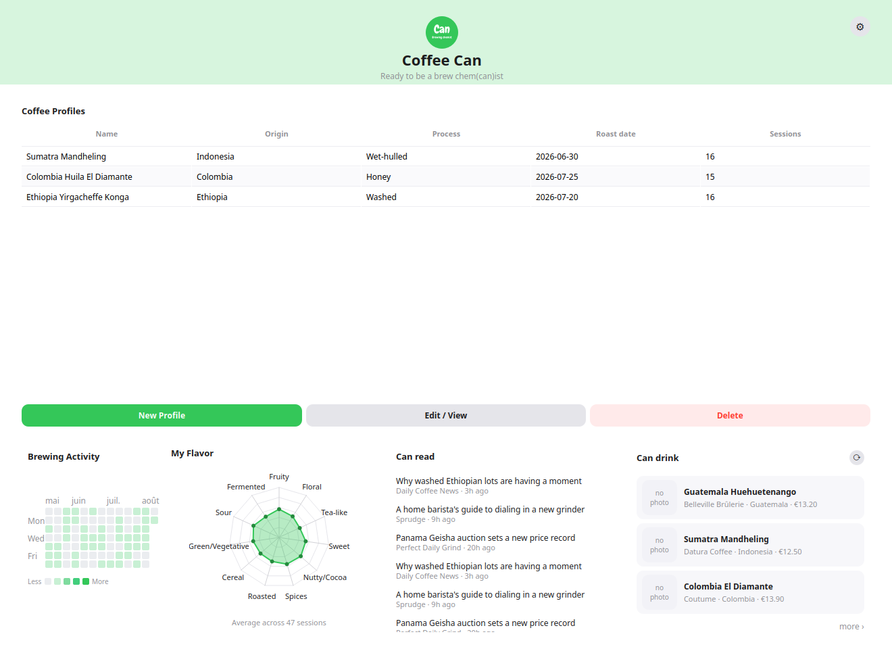
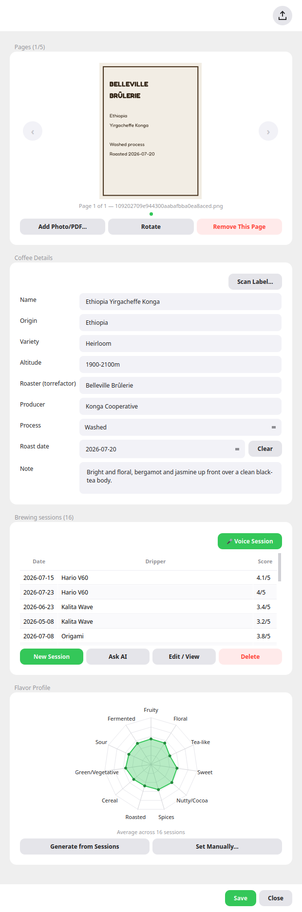
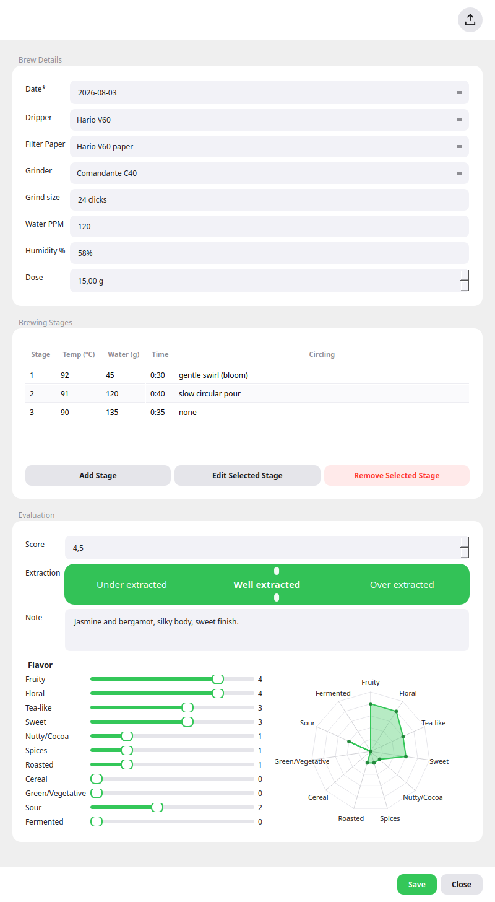
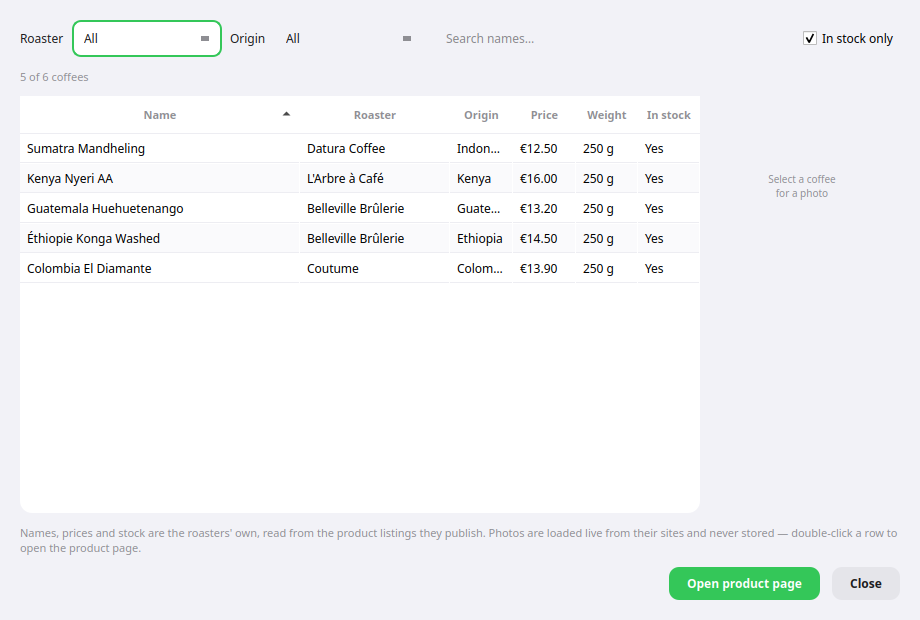

# ☕ Coffee Can

**Your hand-brew coffee, remembered.** Every bag you buy, every cup you pour,
every tweak to grind size or water temperature -- Coffee Can keeps it all in
one place, on your own machine, so you can actually answer "what did I change
last time that made this taste so much better?"

No account, no subscription, no cloud dashboard holding your data hostage:
it's a small desktop app (with a terminal companion for when you'd rather
type than click) backed by a single local file you own.



## What you get

### 🫘 A profile for every bag

Snap or upload a photo of the bag, and Coffee Can reads the label for you --
origin, variety, altitude, roaster, process, roast date, tasting notes --
into an editable form, so you never retype what's already printed on the
label. Keep up to five photos or spec sheets per bag, and come back to edit
any field whenever you like.



### 🧪 A brewing session for every cup

Log the dripper, filter, grinder and grind size, dose and water, then every
pour as its own stage (temperature, water weight, timing). Rate the result on
an under-/well-/over-extraction bar and eleven flavor axes (fruity, floral,
sweet, roasted, and more), and watch a live radar chart draw itself as you
drag the sliders -- so two cups of the same bean become genuinely comparable,
not just a vague memory of "that one was better."



### 🛍️ Something new to try

The **Can drink** shelf puts three coffees currently for sale at real French
specialty roasters (Datura, Belleville Brûlerie, Coutume, L'Arbre à Café,
Tanat) right on your welcome screen -- click the refresh icon for three more,
or **more ›** for the full catalogue, filterable by roaster, origin and
stock. Everything shown -- name, price, weight, stock, photo -- comes
straight from each roaster's own public listing, with a link to buy.



### 📈 The bigger picture

A GitHub-style streak calendar of your brewing activity, and a flavor radar
averaged across every session you've ever logged, so patterns in your own
taste show up on their own -- no spreadsheet required.

## Where AI fits in

AI is never required to use Coffee Can -- every feature below has a
non-AI fallback, or simply doesn't run without a key configured. It's there
to remove typing, not to gatekeep the app.

- **Reading a label photo.** *Scan Label...* turns a photo of the bag into
  filled-in fields. Without an API key it's still fully usable via local
  Tesseract OCR; add a Qwen or Claude API key and label reading gets
  noticeably better at untangling unusual layouts -- which text is the
  origin, which is the process, which is just marketing copy.
- **Describing a brew out loud.** Press *🎤 Voice Session*, talk through the
  dripper, dose and each pour like you would to a friend, and Qwen turns the
  recording into a filled-in session for you to review and save.
- **Getting a starting recipe.** *Ask AI* suggests a full brewing recipe --
  dose, grind size, temperature and timing per stage -- for a given bean and
  dripper, which you can then tweak and log like any other session.
- **A ranked "Can read" feed.** Coffee news headlines are pulled from real
  outlets' own RSS feeds (never AI-generated), with Qwen used only to rank
  which ones are worth your five seconds.

Every one of these degrades gracefully: no key configured just means that one
convenience is off, never a broken screen.

---

A simple app for logging hand-brew coffee: keep a profile per bag of beans,
then log each brewing session (dripper, grinder, water, per-stage pours) and
rate the result. Comes with both a desktop GUI and a CLI -- same data, same
underlying code, pick whichever you prefer on a given day.

## Install (Ubuntu)

```bash
sudo apt install pipx        # if not already installed
pipx ensurepath               # once, then restart your shell
cd coffee
pipx install .                # pulls in PySide6 (Qt), pytesseract, Pillow -- may take a minute
coffeecan-install-launcher    # one-time: adds "Coffee Can" to your app menu
```

The bean page's *Scan Label...* feature needs the Tesseract OCR binary on
your system (`pytesseract` is just a wrapper around it):

```bash
sudo apt install tesseract-ocr
```

Camera capture (*Scan Label... > Take Photo...*) needs a working camera and
PySide6's QtMultimedia bindings; if either is unavailable, that one option is
disabled with a message -- *Choose Photo File...* and everything else in the
app are unaffected.

**Optional: higher-accuracy scanning via Qwen or the Claude API.** Local OCR
maps label text to fields with regex/keyword heuristics, which struggles
with unusual layouts. *Scan Label...* tries, in order: Qwen's vision API if
`pip install openai` and `QWEN_API_KEY` are set (`QWEN_OMNI_MODEL`, default
`qwen3.5-omni-flash` -- the same model and key as the *🎤 Voice Session*
feature below), then Claude's if `pip install anthropic` and
`ANTHROPIC_API_KEY` are set instead (`ANTHROPIC_OCR_MODEL`, default
`claude-opus-5`), then local Tesseract OCR if neither is configured or both
fail. Qwen is checked first deliberately: if you've set both keys (e.g.
because you also use *Voice Session*), scans bill the Qwen key rather than
silently going to Claude's. Either AI path is far more reliable than local
OCR at figuring out which text is the origin vs. the roaster vs. the
process, at the cost of an API key, network access, sending the photo
off-device, and a small per-scan charge. This is fully optional: without
either package or key set, it's local Tesseract OCR from the start.

**Where API keys go.** Keys can live in the real shell environment or in a
`.env` file, and which file is read depends on how you launched the app:

| How you run it | `.env` that's read |
| --- | --- |
| `pipx install`ed (`coffeecan-gui`, app menu icon) | `~/.local/share/coffee-can/.env` |
| From a source checkout | `coffee/.env` (walks up from the package) |

A pipx install **cannot see `coffee/.env`** -- the package lives in pipx's
venv, so walking up from it never reaches your checkout. Editing only
`coffee/.env` and then launching from the app menu leaves the key invisible,
and any feature with a fallback (label scanning falls back Qwen -> Claude ->
local OCR) quietly uses the next one down and bills that provider instead.
If a key doesn't seem to take effect, that's almost always why: put it in
`~/.local/share/coffee-can/.env`.

This installs `coffeecan` (CLI) and `coffeecan-gui` (desktop window) on your
`PATH`. To upgrade after editing the source: `pipx install --force .`. To
remove: `pipx uninstall coffee-can`, and if you ran
`coffeecan-install-launcher`, also delete its two leftover files:

```bash
rm -f ~/.local/share/applications/coffee-can.desktop \
      ~/.local/share/icons/hicolor/scalable/apps/coffee-can.svg
```

Data is stored in `~/.local/share/coffee-can/` (a SQLite database plus a copy
of any uploaded photos/PDFs), independent of where the source lives -- the
GUI and the CLI read and write the exact same files. If you had this app
installed under its old name ("coffee-journal"), the first launch after
upgrading moves `~/.local/share/coffee-journal/` to the new location
automatically -- nothing to do by hand.

## GUI

Launch it from the app menu ("Coffee Can") after running
`coffeecan-install-launcher`, or run `coffeecan-gui` directly. The app icon
and overall theme (`gui/theme.py`) are green; if you'd already run
`coffeecan-install-launcher` before an icon update, rerun it to refresh the
copy under `~/.local/share/icons/`.

The main window is a welcome screen: the logo/title header, a **Coffee
Profiles** card (the bean table), and a resizable row of three panes (drag
the dividers between them) -- a **Profile** card (your name/email/avatar,
edited via the gear button in its corner), a **Brewing Activity** card (a
GitHub-style contribution calendar, `gui/widgets.py`'s `ContributionCalendar`,
showing the last ~3 months as a color-graded grid, one cell per day; hover a
cell for the exact date and count), and a **Flavor Profile** card averaging
the eleven flavor axes across every brewing session you've ever logged.

**Can drink**, the pane on the right, puts three coffees picked at random from
a few French specialty roasters (Datura, Belleville Brûlerie, Coutume,
L'Arbre à Café, Tanat) on a shelf -- photo, name, and who sells it for how
much. Click one and it opens the roaster's own product page in your browser.
**more ›**, top-right of the pane, opens everything they currently list in
one table, which you can narrow by roaster, by origin, to in-stock only, or
by typing part of a name. Origin is worked out from the roaster's own
wording (a bag called "Yirgacheffe" is filed under Ethiopia, one that says
nothing useful under "Not stated") -- it's there to narrow a list, not a
claim about where the coffee is really from.

Everything shown is read from each roaster's own public product-listing feed
(Shopify's `/products.json`, WooCommerce's Store API); nothing scrapes HTML.
Photos are fetched live from the roaster's own site at the moment they're
shown, never downloaded or cached to disk, the same as a browser loading an
image. See `specs/legal.md` for the full reasoning and the rules this feature
follows; the short version is that prices are the roasters' own, shown with
the time they were fetched, and every entry links back to where it came from.

In the Coffee Profiles card, *New Profile* opens a form -- a bean row is
created the moment the dialog opens (blank name until you type one; *Save*
falls back to "Untitled" if it's still empty), so pages and sessions work
immediately with no save-first step. Closing a brand-new profile without
ever touching it (no name, no fields, no pages, no sessions) quietly deletes
the empty draft instead of leaving it in the list. *Add Photo/PDF...* opens a
real file picker (up to 5 pages per profile, shown as a swipeable carousel);
*Rotate* only changes how a page is displayed, the original file on disk is
never modified. *Scan Label...* offers *Take Photo...* (live camera capture)
or *Choose Photo File...*, then reads the photo (Claude's vision API if
you've set it up -- see below -- otherwise local Tesseract OCR via `ocr.py`)
and shows the guessed name/origin/variety/altitude/roaster/producer/process/
roast date/note in an editable review dialog -- nothing is written until you
click *Apply*, and blank fields there are left untouched. It's a best-effort
reading of a photographed label, not a scanner, so always check its guesses.
Applying a scan also keeps the photo itself as one of the profile's pages.
*Process* is a dropdown seeded from `assets/processes.json` (Washed,
Natural, Honey, Anaerobic, and dozens of other named processes). *Note* is a
free-text box for tasting notes or any other remark that has no field of its
own; scanning fills it from the label's printed tasting notes.

Below the profile form, a **Flavor Profile** block shows a radar chart for
that specific bean: *Generate from Sessions* averages the eleven flavor axes
across its own brewing sessions (grey/blank if it has none yet), or *Set
Manually...* opens a slider-per-axis picker to fix the shown profile by hand
regardless of session data.

Brewing sessions live inside that same profile dialog, under a *Brewing
sessions* table scoped to that bean -- there's no separate global sessions
view, since a session only ever makes sense in the context of the coffee it
was brewed from. Like profiles, a session row is created the moment *New
Session* opens (so *Add Stage* works immediately), and an empty one is
discarded on Close the same way. From there: a session form (date, dripper,
filter paper, grinder, grind size, water ppm, humidity, dose in grams --
brew details default to whatever you used last time for that bean), an *Add
Stage* button (temperature via a -10-110°C slider with a synced spinbox for
typing an exact value, defaulting to 90; water in grams; time via an
hh:mm:ss picker; circling/agitation as free text) with a stages table you
can remove rows from, and an evaluation section: a *Score* box (0-5, showing
a grey `0 to 5` hint until you set one -- leave it alone and the session
stays unscored rather than scoring itself 0), a continuous *Extraction* bar
you drag anywhere between *Under extracted* and *Over extracted*, which
tints as it moves (light green at the under end, through the logo's green at
*Well extracted*, to dark green at the over end) and is likewise left unset
until you touch it, a note field, and eleven 0-5 flavor sliders (Fruity, Floral,
Tea-like, Sweet, Nutty/Cocoa, Spices, Roasted, Cereal, Green/Vegetative, Sour,
Fermented) that
redraw a live radar chart as you drag them. *Edit / View* / *Delete* work
the same way on the selected session.

**Optional: fill in a session by describing it out loud.** The *🎤 Voice
Session* button above the sessions table needs PySide6's QtMultimedia
bindings and a working microphone (same requirement as *Scan Label... > Take
Photo...*'s camera capture); if either is missing, the button disables
itself with a message and everything else in the app is unaffected. Press
the mic, describe the brew (dripper, dose, grind size, and each pour), press
it again to stop, and the recording is sent to Qwen's audio-understanding
API (`QWEN_OMNI_MODEL`, default `qwen3.5-omni-flash`) for parsing into the
same session + stage fields the *Ask AI* flow above fills in -- review the
result, then *Create Session* opens it in the normal session form for
further editing. Needs `pip install openai` and `QWEN_API_KEY` set (a
DashScope key); like the *Ask AI* suggestions, if the request fails for any
reason the dialog just reports the error rather than silently falling back
to anything, since there's no local voice-parsing fallback to fall back to.

*Dripper*, *Filter Paper*, *Grinder*, and *Process* are all dropdowns, each
seeded from its own bundled JSON file (`assets/drippers.json`,
`assets/filters.json`, `assets/grinders.json`, `assets/processes.json`).
Pick *Other (type manually)...* on any of them to add one that's missing --
it's saved to `~/.local/share/coffee-can/{drippers,filters,grinders,
processes}.json` and shows up in that dropdown from then on.

## CLI

Prefer scripting or a terminal? Everything above is also available as
`coffeecan` subcommands, driven by guided prompts instead of forms.

### Coffee bean profiles

```bash
coffeecan bean add                 # guided prompts: name, origin, variety, altitude,
                                    # roaster, producer, process, roast date, note,
                                    # up to 5 photos/PDFs of the bag or spec sheet
coffeecan bean edit <id-or-name>   # resume a draft or update any field later
coffeecan bean list                # table of all profiles
coffeecan bean show <id-or-name>   # full detail + its brewing sessions
coffeecan bean delete <id-or-name>
```

Every field except the coffee's name is optional -- leave a prompt blank to
skip it. Answers are saved to disk as soon as you enter them, so if you stop
partway through (Ctrl-C, or answering "no" when asked to mark it complete)
the profile is kept as a **draft** and `coffeecan bean edit` picks up where
you left off.

### Brewing sessions

```bash
coffeecan brew add <bean-id-or-name>   # date, dripper, filter paper, grinder,
                                        # grind size, water ppm, humidity, dose,
                                        # then as many pour stages as you like
                                        # (temperature, water, time, circling),
                                        # then a 0-5 score and a tasting note
coffeecan brew edit <session-id>       # resume a draft, add more stages, or evaluate later
coffeecan brew list [--bean <id-or-name>]
coffeecan brew show <session-id>
coffeecan brew delete <session-id>
```

Sessions follow the same draft-as-you-go behavior as bean profiles.

## Development

```bash
python -m venv .venv && source .venv/bin/activate
pip install -e .
coffeecan bean add     # CLI
coffeecan-gui          # desktop window
```

No test suite is configured; verify changes by exercising the CLI/GUI
directly. `coffeecan`, `coffeecan-gui`, `coffeecan-install-launcher`, and the
`repo.py`/`db.py`/`paths.py`/`formatting.py` modules they share all live
under `src/coffee_can/`.
